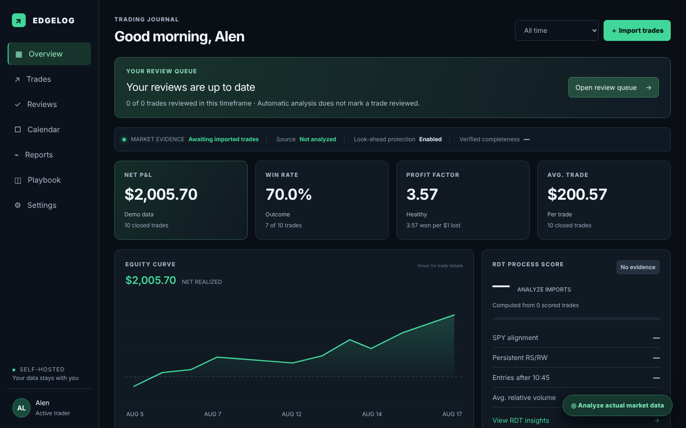

# EdgeLog

EdgeLog is a self-hosted trade journal for day traders who follow the r/RealDayTrading (RDT) method. It imports closed trades from Robinhood and thinkorswim CSV exports, rebuilds market conditions at each entry from historical bars, and grades the entry against a fixed set of RDT rules, so a trade is judged on process and not on whether it made money. It runs as a single Docker container and keeps all data in a local volume.



The screenshot shows the ten fictional demo trades that ship in the code. No real trades are in this repository.

## What it does

- **Import.** Robinhood account-activity CSV and thinkorswim filled-order CSV. Opening and closing fills are paired per symbol using average cost. Trades can also be added by hand or posted as JSON.
- **Entry analysis.** For each trade it loads 5-minute and daily bars for the stock, SPY and a sector ETF, discards everything after the entry timestamp, and computes ATR-normalized relative strength (RRS), SPY trend and VWAP alignment, 3/8 EMA timing, time-of-day relative volume, daily-chart quality and room to the nearest daily pivot.
- **Grading.** Each rule resolves to pass, fail or unverified. Missing data is reported as unverified and is never counted as a pass. Entering before 10:45 ET, incomplete data, or less than 1% of room caps the grade at D. The rules live in [`lib/rdt.ts`](lib/rdt.ts).
- **Review.** A review queue with thesis, reflection, repeat/avoid notes, a followed/broke-process flag and up to two chart screenshots per trade.
- **Reporting.** Net P&L, win rate, profit factor, equity curve, calendar view, and outcome breakdowns by rule (for example, entries after 10:45 against entries before).

## Run it

Requires Docker with Compose.

```bash
docker compose up -d --build
```

Open <http://localhost:3000>. Trades, reviews and cached bars are stored in the `edgelog-data` volume and survive rebuilds.

To run without Docker (Node 22.13 or later, pnpm):

```bash
pnpm install
pnpm run build
pnpm run start      # http://localhost:3000, data in ./.edgelog-data
pnpm test           # review, bar-cache and cohort tests
```

## Configuration

Copy `.env.example` to `.env`. All settings are optional.

| Variable | Purpose |
| --- | --- |
| `MASSIVE_API_KEY` | Use Massive for historical bars. Without it the app falls back to Yahoo's public chart feed. |
| `MARKET_DATA_PROVIDER` | Label shown in the UI for the bar source. |
| `EDGELOG_DATA_DIR` | Where trades, reviews and cached bars are written. `/data` in Docker, `./.edgelog-data` otherwise. |

Bars can also be pushed in from another source with `POST /api/market-bars`. Cached bars take priority over Massive and Yahoo. See [SELF_HOSTING.md](SELF_HOSTING.md) for the payload format.

## Known limitations

- The CSV importer treats option fills as equity, so the 100x contract multiplier is dropped and option P&L is understated.
- Deleting a trade removes it from the screen but sends no request to the server, so it comes back on reload.
- Trades added through the JSON import skip the relative-strength and quality-score pipeline until analysis is run manually.
- The Yahoo fallback is unofficial, rate-limited and only returns recent 5-minute history. Older trades come back as unverified.
- Catalyst and chart-geometry checks cannot be derived from bars and always show as unverified.
- There is no authentication. The API routes, including `/api/market-bars`, trust the network they run on. Keep it on localhost or behind a reverse proxy with its own access control.
- Single user. The display name in the header is hardcoded.
- Every save rewrites the full `trades.json`. There are no migrations and no backups.
- Automated tests cover reviews, the bar cache and cohort maths only. The CSV importer and the grading rules have no tests.
- The project was started from a Cloudflare vinext template. The D1 code path (`db/`, `worker/`, `drizzle.config.ts`) is still present but the self-hosted build uses the JSON files.

## Project structure

```
app/
  page.tsx               dashboard, trades, calendar, reports, playbook, CSV import
  trade-review.tsx       review queue and per-trade review form
  analysis-control.tsx   "Analyze actual market data" button and progress
  api/
    trades/              load and save the trade ledger
    analyze/             run the RDT analysis for a batch of trades
    reviews/             per-trade reviews, with revision checks
    market-bars/         local bar cache (read and push)
    sector-map/          symbol to sector-ETF mapping
    import-robinhood/    pair raw Robinhood fills into trades
lib/
  rdt.ts                 grading rules and indicators
  market-data.ts         bar loading (cache, Massive, Yahoo)
  sector-map.ts          sector taxonomy to ETF mapping
  journal.ts             shared types and cohort summaries
tests/                   node:test suite
db/, worker/             Cloudflare D1 path from the original template
Dockerfile, docker-compose.yml
```
